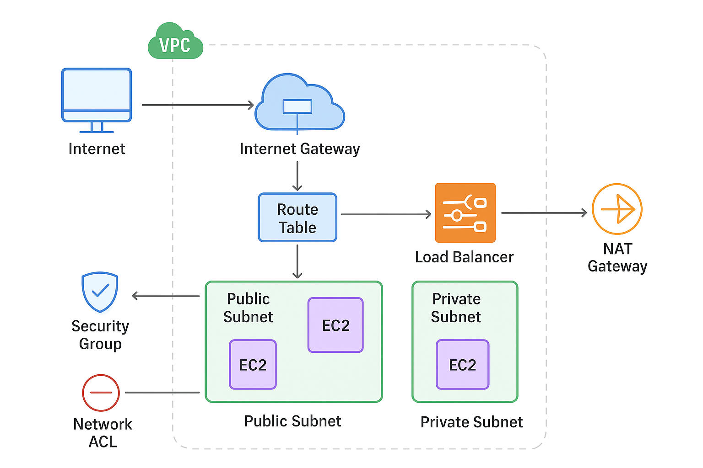

## What is Cloud?
Cloud computing means accessing computing resources—like servers, storage, databases, and software—over the internet instead of managing physical hardware yourself. It offers scalability, cost efficiency, global accessibility, and reliability. For example, using AWS EC2 you can get a server in minutes instead of setting it up physically.

## What is Private Cloud?
Private cloud is when the cloud environment is reserved for just one organization, either hosted on-premises or by a third party. It’s more secure and customizable than public cloud, but also more expensive. Public cloud is shared among many users, while private cloud is dedicated to one.

## What is Public Cloud?
A public cloud is a cloud model where computing resources like servers and storage are owned and managed by a provider such as AWS, Azure, or Google Cloud, and are shared among multiple organizations. You pay as you go, and it’s highly scalable and cost-effective.

## What is Cloud Repatriation?
Moving from public cloud to private cloud is called cloud repatriation.

## Are you using root user?
No, I don’t use the root user for daily operations. I create IAM users with specific permissions for security and follow the principle of least privilege. The root account is reserved only for critical account-level tasks.

*Some services in AWS have elastic as a prefix which shows this particular service can be scaled down or scaled up.*

## What is Virtual Private Cloud (VPC)?
VPC (Virtual Private Cloud) is a logically isolated virtual network in AWS where you can launch and manage your resources like EC2 instances, databases, and load balancers. When a user on the Internet tries to access an application, traffic enters the VPC through the Internet Gateway into the public subnet, where components like a Load Balancer are placed. The Load Balancer then forwards requests to application servers inside the private subnet. Route Tables control traffic flow, Security Groups act as firewalls at the instance level, and NACLs provide subnet-level security.

## What is Internet Gateway?
An Internet Gateway (IGW) in AWS is a network component that enables communication between your VPC and the internet. It allows resources inside your VPC — such as EC2 instances in a public subnet — to send and receive traffic from the internet. Without an Internet Gateway, your instances remain isolated within the VPC and can’t be accessed externally.

## What is Public and Private Subnet?
A **subnet** is a segment of your VPC where you place your AWS resources.

A **public subnet** is a subnet that has a route to the Internet Gateway, so its resources (like EC2 instances) can communicate directly with the internet. This is typically used for web servers or load balancers that need to be publicly accessible.

A **private subnet** is a subnet without a direct route to the internet. Resources here cannot be accessed from the internet directly and are usually used for databases, backend services, or sensitive workloads. To allow outbound internet access (like updates or API calls), a private subnet can use a NAT Gateway.

## What is Load Balancer?
An AWS Load Balancer is a service in Elastic Load Balancing (ELB) that automatically distributes incoming traffic across multiple targets (EC2 instances, containers, IPs, or Lambda functions).
It ensures high availability, fault tolerance, and scalability by preventing any single server from being overloaded.

### Types of Load Balancers in AWS:
**1. Application Load Balancer (ALB):**  
- Works at Layer 7 (HTTP/HTTPS).
- Routes requests based on content (URL path, hostname, query).
- Example: /api → microservice A, /images → microservice B.

**2. Network Load Balancer (NLB):**  
- Works at Layer 4 (TCP/UDP/TLS).
- Handles millions of requests per second with ultra-low latency.
- Example: Ideal for gaming, IoT, or real-time financial apps.  

**3. Gateway Load Balancer (GLB):**  
- Works at Layer 3 (IP level).
- Routes traffic to third-party virtual appliances (firewalls, intrusion detection systems).
- Example: Deploying Palo Alto or Fortinet in AWS.

## What are Route Tables?
Route Tables make sure traffic flows in the right direction, whether it’s between subnets, to the internet, or through other gateways inside your AWS environment. Each route table has entries that define a destination and a target. For example, traffic meant for the internet (0.0.0.0/0) is sent to the Internet Gateway, while traffic meant for private resources might go through a NAT Gateway or stay within the VPC.

## What are Security Groups?
Security Groups in AWS are virtual firewalls attached to your EC2 instances or other resources. We need them to protect our resources by controlling which traffic is allowed to reach them and which traffic can leave them. Without Security Groups, anyone on the internet could attempt to connect to your instances, creating security risks. They work by letting you define rules based on protocols, ports, and source/destination IP addresses. AWS automatically enforces these rules, allowing only the traffic you permit and blocking everything else.

## What are NACL?
Network Access Control Lists (NACLs) in AWS are another layer of security for your VPC subnets. They are used to control inbound and outbound traffic at the subnet level, acting as a filter for all resources inside that subnet. Unlike Security Groups, which are attached to individual instances, NACLs apply to the entire subnet and evaluate rules in order, allowing or denying traffic based on IP addresses, protocols, and ports. They provide an extra layer of defense, especially for controlling traffic entering or leaving a private subnet.

## What are Nat Gateways?
NAT Gateways (Network Address Translation Gateways) in AWS are managed services that allow resources in a private subnet to access the internet for updates, downloads, or API calls without exposing their private IP addresses.
Instances in a private subnet don’t have public IPs, so they can’t directly reach the internet. NAT Gateways let these instances communicate externally securely, while keeping their private IP hidden.
They work by translating the private IP of the instance to the NAT Gateway’s public IP when sending requests to the internet. Responses come back through the NAT Gateway, ensuring the instance can access external resources without being directly exposed.

## 🌐 Request Journey Inside a VPC (Step-by-Step)

  

### 🧭 Step 1: User Sends a Request
- A user types your application URL in their browser.  
- The request comes from the internet and tries to reach your AWS resources.

### 🚪 Step 2: Internet Gateway (IGW)
- The request first hits the Internet Gateway, which acts like the main gate of your VPC.  
- Without this gateway, the internet cannot communicate with anything inside your VPC.

### 🗺️ Step 3: Route Table
Once inside, the request checks the Route Table.
- The Route Table tells the request where to go — for example, toward a Load Balancer or directly to a subnet.
- Think of it as a map that defines all allowed paths for traffic.

### ⚖️ Step 4: Load Balancer
- The Load Balancer receives the incoming traffic and distributes it evenly across multiple EC2 instances (your web servers).  
- This ensures no single server is overloaded and the application stays fast and reliable.

### 🧱 Step 5: Public and Private Subnets
- If your EC2 instances are in a Public Subnet, they can talk directly to the internet (through IGW).  
- If they are in a Private Subnet, they can’t talk to the internet directly. They use a NAT Gateway to make outbound connections securely.

### 🔐 Step 6: NAT Gateway (for Private Subnets)
- The NAT Gateway allows EC2 instances in private subnets to access the internet (for updates or APIs) without exposing them to incoming internet traffic.

### 🧰 Step 7: Security Checks
- Security Groups (SGs) filter traffic to and from individual EC2 instances. They allow or block requests based on defined rules (like allowing HTTP on port 80).  
- Network ACLs (NACLs) act as an extra layer of protection at the subnet level. They control which types of traffic can enter or leave the subnet.

### 💻 Step 8: EC2 Instance Processes the Request
- After passing all the routes and security checks, the request finally reaches the EC2 instance that runs your application.  
- The instance processes the request — for example, fetching data or rendering a web page.

### 🔁 Step 9: Response Sent Back
The EC2 instance sends the response (like your website HTML) back along the same path — through SGs, NACLs, Route Table, and Internet Gateway — back to the user’s browser.

## What is AWS Elastic Container Registry (ECR)?
AWS ECR is a fully managed service where we store our container images. It works just like Docker Hub, but it’s more secure and tightly integrated with AWS services like ECS, EKS, and CodePipeline. Developers push images to ECR and Kubernetes or ECS can pull those images automatically during deployment.

## What is Elastic Container Service (ECS)?
AWS ECS (Elastic Container Service) is a fully managed service that runs and scales Docker containers. It takes care of scheduling, running, and monitoring containers, so developers don’t have to manage servers manually. It can run on EC2 or in a serverless way using AWS Fargate.

## What is AWS Elastic Kubernetes Service (EKS)?
AWS EKS is a managed Kubernetes service by Amazon. It helps you run Kubernetes clusters without having to install or manage the Kubernetes control plane (the master nodes). You just focus on your applications (pods, deployments, services), and AWS handles the heavy lifting — like control plane setup, security, and scaling.

## ECS vs EKS vs Kubernetes