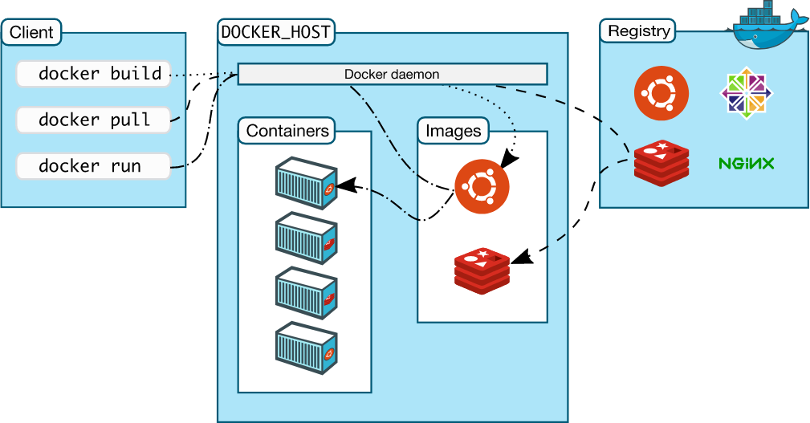

## 1. What is Docker?  
Docker is an open-source platform that lets us package applications and all their dependencies into containers. These containers are lightweight, portable, and run the same way across different environments. It’s mainly used to avoid environment issues, speed up deployments, and make applications more scalable and efficient compared to traditional virtual machines.  

## 2. What are virtual machines?  
A Virtual Machine is a software-based computer that runs its own operating system and apps on top of a physical machine. It’s managed by a hypervisor and provides isolation, making it useful for running multiple OSes or testing in different environments.  

## 3. What is difference between VM and Docker?  
Docker and virtual machines are both technologies used to isolate applications and their dependencies, but they have some key differences:  
**1. Resource Utilization:** Containers share the host operating system kernel, making them lighter and faster than VMs. VMs have a full-fledged OS and hypervisor, making them more resource-intensive.  
**2. Portability:** Containers are designed to be portable and can run on any system with a compatible host operating system. VMs are less portable as they need a compatible hypervisor to run.  
**3. Security:** VMs provide a higher level of security as each VM has its own operating system and can be isolated from the host and other VMs. Containers provide less isolation, as they share the host operating system.  
**4. Management:** Managing containers is typically easier than managing VMs, as containers are designed to be lightweight and fast-moving. 

## 4. What is a hypervisor?  
A hypervisor is software that creates and manages virtual machines by allocating hardware resources to them. It allows multiple operating systems to run on one physical machine.  

## 5. What is Docker Architecture?   
Docker Architecture is a client-server-based architecture that defines how Docker components interact to build, ship, and run containerized applications. It includes the **Docker Client**, **Docker Daemon (Engine)**, **Docker Objects (Images, Containers)**, and **Registries**.   
  

**Docker Client:** CLI or API used to communicate with Docker Daemon (docker build, docker run).  

**Docker Daemon (Docker Engine):** Runs on the host and manages images, containers, networks, and storage.  

**Docker Images:** Read-only templates used to create containers.  

**Docker Containers:** Running instances of images, providing isolated runtime environments.  

**Dockerfile:** Dockerfile is a file where you provide the steps to build your Docker Image.  

**Docker Registries:** Storage for images (like Docker Hub Docker Hub (*place where you share your docker images with external hub*) or private registries).  

*Orchestration Layer:* Tools like Kubernetes or Docker Swarm for managing multiple containers.  

### Docker LifeCycle  
- **docker build ->** builds docker images from Dockerfile  
- **docker run ->** runs container from docker images  
- **docker push ->** push the container image to public/private regestries to share the docker images.     

## 5. What is Docker Container?  
A Docker container is a lightweight, standalone package that includes an application and all its dependencies. It runs in an isolated environment, ensuring consistency across different systems, is faster and more resource-efficient than virtual machines, and is widely used for scalable and microservices-based deployments.   

## 6. Why are containers light weight?   
Containers are lightweight because they share the main operating system of your computer instead of carrying a full OS like a virtual machine does. Each container still keeps your app and its dependencies separated and safe from other apps. This makes containers much smaller and faster. On top of that, Docker containers only include what your app actually needs to run, which keeps their size minimal.   

## 7. What is the architecture of containers?  

+-----------------------+  
|   Container (App)     | *Lightweight, isolated runtime environments for apps.*   
+-----------------------+  
|   Docker Image Layer  | *Read-only templates used to create containers.*    
+-----------------------+  
|   Docker Engine       | *Core software that runs containers (builds images, manages containers, handles networking).*    
+-----------------------+  
|   Host OS & Kernel    | *Provides system resources like CPU, memory, and I/O.*   
+-----------------------+  
|   Physical Hardware   |    
+-----------------------+    

The architecture of containers is layered. The Docker Engine runs on the host OS and manages containers. Each container is created from a Docker image, providing an isolated environment for the app while sharing the host OS kernel. Networking and volumes allow communication and persistent storage. For multiple containers, orchestration tools like Kubernetes handle scaling, load balancing, and monitoring.  


## 8. What is a Multi-Stage Docker Build?  
A Multi-Stage Docker Build is a way to create Docker images in multiple steps within one Dockerfile.

The main reason we use multi-stage builds is to reduce the final image size and make it more efficient. Normally, when you build an app inside Docker, the image includes all the build tools and temporary files, even though they aren’t needed in production. This makes the image large, slow, and less secure. Multi-stage builds solve this by using one stage for building and another for running, and only copying the required files from the builder to the final stage.


**Distroless Image:**   
Distroless images are special Docker images that contain only the files needed to run your app, nothing extra — no shell, no package manager, no tools. We use them because they make our applications more secure, lighter, and faster. When an image has less stuff inside it, there is less for hackers to attack, less space taken on servers, and less time spent pulling or deploying it. They also help keep production environments clean, because only the final application code goes inside the container. We use distroless images by first building our full app in a normal image (using a multi-stage build) and then copying only the final output into the distroless image. This way, we get a very small, very secure final container that is perfect for production.


### Optimizing the Same Node.js App We Containerized Above  
**Rewrite the Dockerfile**
```
# First stage: Build
FROM node:18 AS builder

WORKDIR /app
COPY package*.json ./
RUN npm install
COPY . .

# Second stage: Production
FROM node:18-slim

WORKDIR /app
COPY --from=builder /app ./

EXPOSE 3000
CMD ["node", "server.js"]   
```

**– Build the new optimized Docker Image**  
```
docker build -t myapp-multistage .   
```
*Run `docker images` Compare the image size with the previous build — you’ll notice a huge difference.*  

## 9. What’s the difference between Docker volumes and Bind mounts?  
The main difference between Docker volumes and bind mounts is where the data is stored and how it’s managed.

**Bind mounts** directly link a folder from your computer (the host machine) to a folder inside the container. So if you make a change on your computer, it immediately shows up inside the container, and vice versa. It’s great for development when you want live updates — for example, editing your app code on your system and seeing changes instantly in the running container. But the downside is that it depends on your system’s file structure and can be messy or less secure.

**Volumes**, on the other hand, are fully managed by Docker. The data is stored in a special Docker-controlled location (usually under /var/lib/docker/volumes). This makes them more portable, secure, and reliable — ideal for production use. Docker handles everything behind the scenes, so even if you remove a container, the data in a volume stays safe. 

## Docker Networking: Bridge vs Host vs Overlay  
### Bridge Network
Default network created by Docker for containers on a single host. Lets containers communicate with each other securely while isolating them from the host network.  

### Host Network
Containers share the host’s network stack. It performs better (since there’s no network translation), but it’s less secure because the container is directly exposed to the outside network. It’s often used for performance-critical apps or when you need full host network access.   

### Overlay Network
Overlay networks are used when your Docker containers are not all on the same physical or virtual machine (like Docker Swarm or Kubernetes). Enables secure cross-host communication between containers. Docker creates an encrypted VXLAN overlay network. Containers on different hosts appear as if on the same network.  

### Securing containers with custom bridge network
By default, Docker creates a bridge network called bridge. All containers connected to it can communicate freely, and ports are exposed to the host. This can be insecure for production or multi-container setups because containers can see each other even if they don’t need to.

A custom bridge network allows you to:
- Isolate containers that don’t need to talk to each other.
- Control communication between containers explicitly.
- Avoid exposing unnecessary ports to the host.
- Give containers predictable DNS names for easier inter-container communication.

## Docker Compose
Docker Compose is a tool that lets you define and manage multi-container applications using a single YAML file.
Instead of running multiple docker run commands, you describe everything — containers, networks, volumes, environment variables — in a single file (docker-compose.yml) and start them all at once using docker-compose up.
When your app has multiple services (like frontend, backend, and database), manually linking containers becomes messy.
Docker Compose simplifies this — it manages dependencies, networking, and lifecycle (start, stop, rebuild) of all services together.

---
services:
  # ******************
  # Core Demo Services
  # ******************
  # Accounting service
  accounting:
    image: ${IMAGE_NAME}:${DEMO_VERSION}-accounting
    container_name: accounting
    build:
      context: ./
      dockerfile: ${ACCOUNTING_DOCKERFILE}
      cache_from:
        - ${IMAGE_NAME}:${IMAGE_VERSION}-accounting
    deploy:
      resources:
        limits:
          memory: 120M
    restart: unless-stopped
    environment:
      - KAFKA_ADDR
      - OTEL_EXPORTER_OTLP_ENDPOINT=http://${OTEL_COLLECTOR_HOST}:${OTEL_COLLECTOR_PORT_HTTP}
      - OTEL_EXPORTER_OTLP_METRICS_TEMPORALITY_PREFERENCE
      - OTEL_RESOURCE_ATTRIBUTES
      - OTEL_SERVICE_NAME=accounting
      - DB_CONNECTION_STRING=Host=${POSTGRES_HOST};Username=otelu;Password=otelp;Database=${POSTGRES_DB}
      - OTEL_DOTNET_AUTO_TRACES_ENTITYFRAMEWORKCORE_INSTRUMENTATION_ENABLED=false
    depends_on:
      otel-collector:
        condition: service_started
      kafka:
        condition: service_healthy
    logging: *logging
--- 


**ports**  
1. Accessing a container from a browser.  
`ports: - "8080:80"`  
- 80 = internal port inside the container  
- 8080 = external port on the EC2 machine or your local computer

2. Container-to-container communication.  
Inside docker-compose, all containers are in the same internal network. They communicate using service name + internal port, NOT the exposed port.  Even if we don’t write ports at all, other containers can still access it because Docker auto-connects containers using service name.  
Note: If we dont want the contaierns to talk, just seperate the network.-
