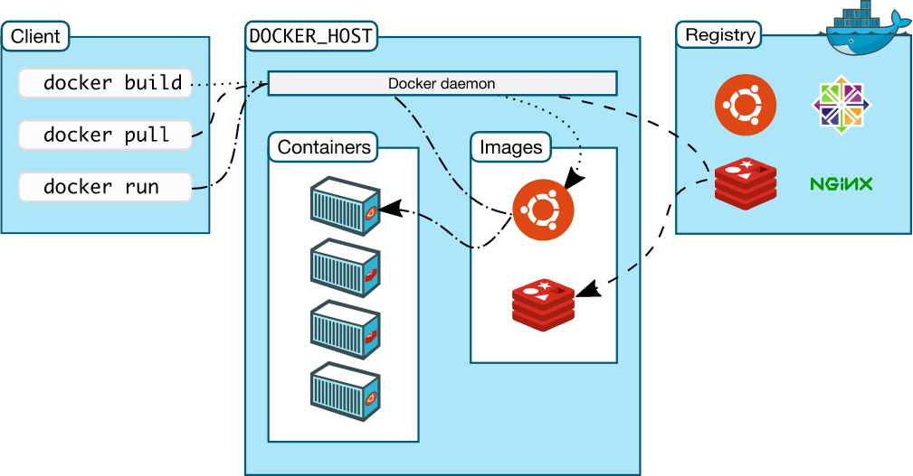

## 1. What is Docker?  
Docker is an open-source platform that lets us package applications and all their dependencies into containers. These containers are lightweight, portable, and run the same way across different environments. It’s mainly used to avoid environment issues, speed up deployments, and make applications more scalable and efficient compared to traditional virtual machines.  

## 2. What are virtual machines?  
A Virtual Machine is a software-based computer that runs its own operating system and apps on top of a physical machine. It’s managed by a hypervisor and provides isolation, making it useful for running multiple OSes or testing in different environments.  

## 3. What is difference between VM and Docker?  
Docker and virtual machines are both technologies used to isolate applications and their dependencies, but they have some key differences:  
**1. Resource Utilization:** Containers share the host operating system kernel, making them lighter and faster than VMs. VMs have a full-fledged OS and hypervisor, making them more resource-intensive.  
**2. Portability:** Containers are designed to be portable and can run on any system with a compatible host operating system. VMs are less portable as they need a compatible hypervisor to run.  
**3. Security:** VMs provide a higher level of security as each VM has its own operating system and can be isolated from the host and other VMs. Containers provide less isolation, as they share the host operating system.  
**4. Management:** Managing containers is typically easier than managing VMs, as containers are designed to be lightweight and fast-moving. 

## 4. What is a hypervisor?  
A hypervisor is software that creates and manages virtual machines by allocating hardware resources to them. It allows multiple operating systems to run on one physical machine.  

## 5. What is Docker Architecture?   
Docker Architecture is a client-server-based architecture that defines how Docker components interact to build, ship, and run containerized applications. It includes the **Docker Client**, **Docker Daemon (Engine)**, **Docker Objects (Images, Containers)**, and **Registries**.   
  

**Docker Client:** CLI or API used to communicate with Docker Daemon (docker build, docker run).  

**Docker Daemon (Docker Engine):** Runs on the host and manages images, containers, networks, and storage.  

**Docker Images:** Read-only templates used to create containers. A Docker image is like a blueprint of an application and everything it needs to run—code, libraries, dependencies, environment variables.   

**Docker Containers:** A container is a running instance of an image. The image itself is static—it’s just the blueprint with your app and dependencies. The container is like a “live copy” of that blueprint that can actually execute code, hold temporary data, and interact with the system. When you run a container, Docker takes the image, sets up a thin writable layer on top, and starts executing it. This writable layer is where all changes inside the container happen (like creating files, updating data, or installing something temporarily). The image underneath remains unchanged, so you can always create new containers from the same image, and they’ll start fresh every time.      

**Dockerfile:** A Dockerfile is a text file that contains commands or instructions to build a Docker image. It can specify the base image, the files to add to the container, the commands to run during the build process, and the command to run when the container starts.

**Docker Registries:** Storage for images (like Docker Hub Docker Hub (*place where you share your docker images with external hub*) or private registries).  

*Orchestration Layer:* Tools like Kubernetes or Docker Swarm for managing multiple containers.  

### Docker LifeCycle  
- **docker build ->** builds docker images from Dockerfile  
- **docker run ->** runs container from docker images  
- **docker push ->** push the container image to public/private regestries to share the docker images.     

## 5. What is Docker Container?  
A Docker container is a lightweight, standalone package that includes an application and all its dependencies. It runs in an isolated environment, ensuring consistency across different systems, is faster and more resource-efficient than virtual machines, and is widely used for scalable and microservices-based deployments.   

## 6. Why are containers light weight?   
Containers are lightweight because they share the main operating system of your computer instead of carrying a full OS like a virtual machine does. Each container still keeps your app and its dependencies separated and safe from other apps. This makes containers much smaller and faster. On top of that, Docker containers only include what your app actually needs to run, which keeps their size minimal.   

## 7. What is the architecture of containers?  

+-----------------------+  
|   Container (App)     | *Lightweight, isolated runtime environments for apps.*   
+-----------------------+  
|   Docker Image Layer  | *Read-only templates used to create containers.*    
+-----------------------+  
|   Docker Engine       | *Core software that runs containers (builds images, manages containers, handles networking).*    
+-----------------------+  
|   Host OS & Kernel    | *Provides system resources like CPU, memory, and I/O.*   
+-----------------------+  
|   Physical Hardware   |    
+-----------------------+    

The architecture of containers is layered. The Docker Engine runs on the host OS and manages containers. Each container is created from a Docker image, providing an isolated environment for the app while sharing the host OS kernel. Networking and volumes allow communication and persistent storage. For multiple containers, orchestration tools like Kubernetes handle scaling, load balancing, and monitoring.  


## 8. What is a Multi-Stage Docker Build?  
A Multi-Stage Docker Build is a way to create Docker images in multiple steps within one Dockerfile.

The main reason we use multi-stage builds is to reduce the final image size and make it more efficient. Normally, when you build an app inside Docker, the image includes all the build tools and temporary files, even though they aren’t needed in production. This makes the image large, slow, and less secure. Multi-stage builds solve this by using one stage for building and another for running, and only copying the required files from the builder to the final stage.


**Distroless Image:**   
Distroless images are special Docker images that contain only the files needed to run your app, nothing extra — no shell, no package manager, no tools. We use them because they make our applications more secure, lighter, and faster. When an image has less stuff inside it, there is less for hackers to attack, less space taken on servers, and less time spent pulling or deploying it. They also help keep production environments clean, because only the final application code goes inside the container. We use distroless images by first building our full app in a normal image (using a multi-stage build) and then copying only the final output into the distroless image. This way, we get a very small, very secure final container that is perfect for production.


## 9. What’s the difference between Docker volumes and Bind mounts?  
The main difference between Docker volumes and bind mounts is where the data is stored and how it’s managed.

**Bind mounts** directly connect a folder on your own host machine to a folder inside the container. This allows instant two-way synchronization — if you change a file in your system, it changes inside the container, and vice-versa. Bind mounts are commonly used in development because they allow you to edit code locally and see the changes reflected inside the running container immediately, making development faster and smoother.

**Volumes** are storage spaces that Docker creates and manages by itself, outside of the container but still on the host machine. They allow a container to store data permanently, even if the container stops, restarts, or gets deleted. The main purpose of volumes is to have a safe and consistent way of storing persistent data, especially in production environments, where Docker manages the storage location and performance optimizations behind the scenes.


## 10. Docker Networking: Bridge vs Host vs Overlay  
**Bridge Network**  
Default network created by Docker for containers on a single host. Lets containers communicate with each other securely while isolating them from the host network.  

**Host Network**  
Containers share the host’s network stack. It performs better (since there’s no network translation), but it’s less secure because the container is directly exposed to the outside network. It’s often used for performance-critical apps or when you need full host network access.   

**Overlay Network**  
Overlay networks are used when your Docker containers are not all on the same physical or virtual machine (like Docker Swarm or Kubernetes). Enables secure cross-host communication between containers. Docker creates an encrypted VXLAN overlay network. Containers on different hosts appear as if on the same network.  

**Securing containers with custom bridge network**  
By default, Docker creates a bridge network called bridge. All containers connected to it can communicate freely, and ports are exposed to the host. This can be insecure for production or multi-container setups because containers can see each other even if they don’t need to.

A custom bridge network allows you to:
- Isolate containers that don’t need to talk to each other.
- Control communication between containers explicitly.
- Avoid exposing unnecessary ports to the host.
- Give containers predictable DNS names for easier inter-container communication.

## 11. Docker Compose
Docker Compose is a tool that lets you define and manage multi-container applications using a single YAML file.
Instead of running multiple docker run commands, you describe everything — containers, networks, volumes, environment variables — in a single file (docker-compose.yml) and start them all at once using docker-compose up.
When your app has multiple services (like frontend, backend, and database), manually linking containers becomes messy.
Docker Compose simplifies this — it manages dependencies, networking, and lifecycle (start, stop, rebuild) of all services together.

```
services:  
  accounting:    
    image: ${IMAGE_NAME}:${DEMO_VERSION}-accounting   
    container_name: accounting   
    build:   
      context: ./   
      dockerfile: ${ACCOUNTING_DOCKERFILE}   
      cache_from:   
        - ${IMAGE_NAME}:${IMAGE_VERSION}-accounting   
    deploy:   
      resources:   
        limits:   
          memory: 120M    
    restart: unless-stopped   
    environment:    
      - KAFKA_ADDR   
      - OTEL_EXPORTER_OTLP_ENDPOINT=http://${OTEL_COLLECTOR_HOST}:${OTEL_COLLECTOR_PORT_HTTP}   
      - OTEL_EXPORTER_OTLP_METRICS_TEMPORALITY_PREFERENCE   
      - OTEL_RESOURCE_ATTRIBUTES    
      - OTEL_SERVICE_NAME=accounting     
      - DB_CONNECTION_STRING=Host=${POSTGRES_HOST};Username=otelu;Password=otelp;Database=${POSTGRES_DB}    
      - OTEL_DOTNET_AUTO_TRACES_ENTITYFRAMEWORKCORE_INSTRUMENTATION_ENABLED=false   
    depends_on:    
      otel-collector:   
        condition: service_started   
      kafka:   
        condition: service_healthy   
    logging: *logging   
```


**ports**  
1. Accessing a container from a browser.  
`ports: - "8080:80"`  
- 80 = internal port inside the container  
- 8080 = external port on the EC2 machine or your local computer

2. Container-to-container communication.  
Inside docker-compose, all containers are in the same internal network. They communicate using service name + internal port, NOT the exposed port.  Even if we don’t write ports at all, other containers can still access it because Docker auto-connects containers using service name.  
Note: If we dont want the contaierns to talk, just seperate the network.-

## 12. You're in charge of maintaining Docker environments in your company and you've noticed many stopped containers and unused networks taking up space. Describe how you would clean up these resources effectively to optimize the Docker environment?
The `docker prune` command is used to clean up unused Docker resources, such as containers, volumes, networks, and images. It helps reclaim disk space and tidy up the Docker environment by removing objects that are not in use.

There are different types of `docker prune` commands:

- `docker container prune`: Removes stopped containers.
- `docker volume prune`: Deletes unused volumes.
- `docker network prune`: Cleans up unused networks.
- `docker image prune`: Removes unused images.

Running **`docker system prune`** combines these functionalities into one command, ensuring that Docker removes any resources not associated with a running container.


## 13. A company wants to create thousands of Containers. Is there a limit on how many containers you can run in Docker?
There is no fixed hard-coded limit inside Docker for how many containers you can run — Docker doesn’t say “maximum 1000 containers” or anything like that. The real limit comes from your machine’s resources such as CPU, RAM, storage speed, and network capacity, because each container consumes a bit of processing power and memory. So companies can run thousands (or even tens of thousands) of containers, but they don’t do it on a single computer — they use container orchestration systems like Kubernetes or Docker Swarm to distribute those containers across many servers. This works by creating a cluster of machines where containers are spread intelligently based on available resources, allowing large-scale deployment efficiently and without overloading a single host system.


## 14. You're managing a Docker environment and need to ensure that each container operates within defined CPU and memory limits. How do you limit the CPU and memory usage of a Docker container?
Docker allows you to limit the CPU and memory usage of a container using resource constraints. You can set the CPU limit with the --cpu option and the memory limit with the --memory option when running the container using the docker run command.

For example, **`docker run --cpu 2 --memory 1g mycontainer`** limits the container to use a maximum of 2 CPU cores and 1GB of memory.


## 15. What is the purpose of the CMD instruction in a Dockerfile?
The `CMD` instruction in a Dockerfile specifies the default command to be executed when a container is started from the Docker image. It defines the primary functionality of the container, such as running an application or executing a script. If a Docker container is started without specifying a command, the command specified in the `CMD` instruction will be executed by default.


## 16. You're part of a development team deploying a microservices architecture using Docker containers. One of the containers, critical to the system's functionality, has suddenly started failing without clear error messages. How do you debug issues in a failing Docker container?
There are several techniques to debug issues in a Docker container:

**Logging**: Check the container logs using **`docker logs <container>`** because this shows what the application inside the container was outputting when it crashed.

**Shell access**: Run the container in interactive mode or exec into it using **`docker exec-it <container> /bin/sh or /bin/bash`** to directly inspect files, processes, or configurations from inside.

**Image inspection**: You can inspect the Docker image's contents and configuration using **`docker image inspect`**. This lets you check for potential misconfigurations or missing dependencies.

**Health checks**: Docker supports defining health checks for containers, allowing you to monitor the health status and automatically restart or take action based on predefined conditions.


## 17. You're working on a critical application running in Docker containers, and an update needs to be applied without risking data loss. How do you update a Docker container without losing data?
The steps to update a Docker container without losing data are:

- Store the data outside the container itself, using Docker volumes.    
- Stop the container gracefully using the **`docker stop`** command.   
- Pull the latest version of the container image using **`docker pull`.**   
- Start a new container using the updated image, while attaching the same volume so the new container continues using the existing persistent data.   
- Verify that the new container is functioning correctly and that the data is still intact. 


## 18. You're responsible for securing the Docker containers hosting your organization's sensitive applications. How do you secure Docker containers?
The way you do this is by using minimal base images (like Alpine or distroless), running containers as non-root users, only exposing necessary ports, limiting runtime permissions with flags like --read-only and --cap-drop, scanning images for vulnerabilities, and keeping images and dependencies updated. You also secure data access through volumes with correct permissions, restrict environment secrets using tools like Docker secrets or external secret managers, and use network segmentation so containers only communicate with services they actually need.

## 19. How do you monitor Docker containers?
There are various ways to monitor Docker containers, including:

- Using Docker's built-in container monitoring commands, such as **docker stats** and **docker container stats**, to view resource usage statistics.  
- Integrating with container monitoring and logging tools like Prometheus, Grafana, or ELK stack (Elasticsearch, Logstash, Kibana) to collect and analyze container metrics and logs.  
- Leveraging container orchestration platforms that offer built-in monitoring capabilities such as Docker Swarm's service metrics or Kubernetes' metrics API.   
- Using specialized monitoring agents or tools that provide container-level insights and integration with broader monitoring and alerting systems.   


## 20. What are some best practices for using Docker in production environments?
Some best practices for using Docker in production environments include:

- Building and using lightweight container images to improve deployment speed and reduce the attack surface.    
- Regularly updating Docker and the underlying host system with security patches.    
- Implementing container orchestration platforms, such as Docker Swarm or Kubernetes, to manage containers at scale and provide features like load balancing and service discovery.   
- Configuring resource limits for containers to prevent resource contention and ensure fair allocation.   
- Monitoring container health, resource usage, and application metrics for performance optimization and troubleshooting.   
- Implementing secure network configurations such as using private networks and encrypting container traffic.    
- Backing up critical data and using volume or storage solutions that provide data persistence and redundancy.    
- Implementing a comprehensive security strategy, including container vulnerability scanning, access controls, and least privilege principles.   

## 21. How to write Dockerfile?

1. `FROM`: Mention base image here. To decide the right base image, use these signals:   

**a. Runtime requirement:**    
If app needs Node.js and npm, then the base image must provide exactly that runtime. Like `CMD` runs `npm start` and `npm` belongs to Node.js. So base image must already contain Node.js + npm

**b. Image size and purpose:**   
i. Is this image used for development or running?   
ii. Do we need build tools inside this image?   

**c. Compatibility with app:**   
Node version mentioned in `package.json` or README must match with the base image.

2. `WORKDIR /app`:   Creates an app folder inside container where all the code will be copied and build tools are installed.

3. `COPY package*.json ./`    Copies the file that list the depedencies. So mostly it is package.json.
4. `RUN npm install`    Reads the copied package.json and install the depedencies.
5. `COPY . .`    Copy the application code.    
6. `RUN npm run build`    React creates files HTML/CSS/JS and save them into folder `/app/build`. So this folder contains complete website.   
7. `COPY --from=builder /app/build /usr/share/nginx/html`    The final built files are copied from `/app/build` and stored in this Nginx directory to server these files in production.     
6. `EXPOSE 3000`    Port that container listens on.     
7. `CMD ["npm", "start"]`     Command required to run the application (check package.json for this command).

## 22. What will you do if container keeps restarting?
1. First, I would **check the container status and restart reason**, because states like CrashLoopBackOff or exit codes indicate why it is restarting.

2. Then, I would **inspect container logs**, to identify errors such as application crashes, missing dependencies, or configuration issues.

3. Next, I would **verify environment variables, secrets, and configuration**, since incorrect setup is a common cause of continuous restarts.

4. After that, I would **check resource limits like CPU and memory**, to see if the container is getting killed due to OOM or insufficient resources.

5. I would also **review health checks (liveness/readiness probes)**, because misconfigured probes can cause unnecessary restarts even if the app is running.

6. Finally, I would **reproduce the issue in a staging or test environment**, so I can safely debug and fix the root cause before applying changes in production. 

## 23. A container is continuously restarting in production. How would you troubleshoot this issue?
1. First, I would **check the container/pod status and restart reason**, because states like CrashLoopBackOff or exit codes give the first hint about why it is restarting.

2. Then, I would **look at the container logs**, to identify errors such as application crashes, missing dependencies, or configuration issues causing the failure.

3. Next, I would **verify configuration like environment variables, secrets, and mounted volumes**, because incorrect configuration is a common reason for continuous restarts.

4. After that, I would **check resource limits like CPU and memory**, to see if the container is getting killed due to OOM (out of memory) or insufficient resources.

5. I would also **review health checks (liveness/readiness probes)**, because misconfigured probes can restart a healthy container repeatedly.

6. Finally, if needed, I would **reproduce the issue in a staging environment**, so I can debug safely and fix the root cause before applying changes in production. 

## 24. A Docker container is running but the application inside is not accessible. What steps would you take to debug the issue?
1. First, I would **check container logs using `docker logs <container>`**, to confirm whether the application started properly or failed silently, because a running container doesn’t guarantee the app inside is healthy.

2. Then, I would **verify container status and port mapping using `docker ps`**, to ensure the correct port is exposed and mapped (e.g., `0.0.0.0:3000->3000`), since wrong mapping can block access.

3. Next, I would **exec into the container (`docker exec -it <container> /bin/sh`) and check if the application process is running**, because the container might be up but the app inside may have crashed.

4. After that, I would **check if the application is listening on the correct port using tools like `netstat` or `ss`**, to ensure it is actually accepting connections.

5. I would also **verify that the application is bound to `0.0.0.0` and not `localhost`**, because binding to localhost makes it inaccessible from outside the container.
<<<<<<< HEAD

6. Finally, I would **check firewall rules, Docker network settings, and overall configuration**, to ensure there is no external restriction or mismatch preventing access. 
=======
>>>>>>> fde29a3470000c388fcd504aa05792770174473e

6. Finally, I would **check firewall rules, Docker network settings, and overall configuration**, to ensure there is no external restriction or mismatch preventing access.
7. 
## 25. A container is consuming very high CPU usage. How would you identify the root cause and resolve it?
1. First, I would **confirm the CPU spike using tools like `docker stats`, `kubectl top pods`, or `top`**, to check if it is temporary or sustained and identify when it started.

2. Then, I would **identify which container and process is consuming high CPU using `docker stats`, `docker exec -it <container> top`, or `ps aux --sort=-%cpu`**, to pinpoint the exact source of the issue.

3. Next, I would **check application logs using `docker logs <container>` or `kubectl logs <pod>`**, because high CPU is often caused by bugs, infinite loops, or inefficient code paths.

4. After that, I would **analyze workload and traffic patterns using `kubectl describe pod <pod>` or monitoring tools**, to determine if the spike is due to increased load instead of a code issue.

5. I would also **check resource limits and throttling using `docker inspect <container>` or `kubectl describe pod <pod>`**, to ensure CPU limits are not misconfigured or causing throttling.

6. Finally, based on findings, I would **optimize the application, fix inefficient logic, or scale the system using autoscaling (`kubectl autoscale`)**, and add monitoring/alerts to prevent future issues.  

## 26. Disk space on the Docker host is suddenly full. How would you identify what is consuming space and fix it?
1. First, I would **confirm disk usage on the host using commands like `df -h`**, to see which partition is full and how critical the situation is.

2. Then, I would **identify what is consuming space using `du -sh` and Docker-specific commands like `docker system df`**, because Docker images, containers, volumes, and logs are common causes.

3. Next, I would **check for unused or stopped containers, dangling images, and unused volumes**, since these often take up a lot of space unnecessarily.

4. After that, I would **clean up unused resources using commands like `docker container prune`, `docker image prune`, or `docker system prune`**, to quickly free up space.

5. I would also **inspect container logs (like `/var/lib/docker/containers/...`)**, because large log files can silently fill up disk space.

6. Finally, I would **implement log rotation, regular cleanup policies, and monitoring alerts**, so disk space issues are prevented in the future. 

## 27. A container fails to start due to a port conflict. How would you troubleshoot and resolve this issue?
1. First, I would **check the error message from Docker or container logs**, because it usually clearly mentions that the port is already in use.

2. Then, I would **identify which process or container is using that port**, using commands like `netstat`, `lsof`, or `docker ps`, to find the conflicting service.

3. Next, I would **decide whether that existing service is needed**, because if it’s unnecessary, I can stop or remove it to free the port.

4. If the port is required by another service, I would **change the port mapping of the new container**, so both services can run without conflict.

5. After that, I would **verify the application configuration inside the container**, to ensure it is listening on the correct port that matches the mapping.

6. Finally, I would **restart the container and test connectivity**, to confirm the issue is resolved and the application is accessible.

## 28. Docker image builds are taking too long in CI/CD pipelines. How would you optimize the build time?
1. First, I would **enable Docker layer caching in the CI/CD pipeline**, so unchanged layers are reused instead of rebuilding everything from scratch.

2. Then, I would **optimize the Dockerfile order**, placing frequently changing steps (like copying source code) at the end and stable steps (like installing dependencies) at the top, to maximize cache usage.

3. Next, I would **use smaller base images like Alpine**, to reduce build time and image size.

4. I would also **remove unnecessary files using `.dockerignore`**, so only required files are sent to the build context.

5. After that, I would **use multi-stage builds**, to keep the final image lightweight and avoid unnecessary build dependencies.

6. Finally, I would **parallelize builds or use build tools like BuildKit**, and consider using pre-built base images or dependency caching to further speed up the pipeline. 

## 29. After deploying a new container version, the application stops working. How would you roll back to the previous version?
1. First, I would **identify that the issue started after the new deployment**, by checking logs, monitoring, and recent changes, to confirm rollback is needed.

2. Then, I would **quickly roll back to the previous stable version**, using the deployment tool (like Kubernetes rollout undo, Docker image tag revert, or CI/CD rollback), so service is restored fast.

3. Next, I would **ensure traffic is routed back to the old version**, either by reverting deployment configuration or adjusting load balancer routing.

4. After that, I would **verify that the previous version is running correctly**, by checking health checks, logs, and user impact.

5. Finally, I would **analyze the failed deployment to find the root cause**, so the issue can be fixed before redeploying and to prevent similar problems in the future. 

## 30. Containers are not able to communicate with each other across hosts. What could be the possible reasons?
1. First, I would **check whether the containers are on the same network or overlay network is properly configured**, because cross-host communication requires proper networking setup like Docker overlay or Kubernetes CNI.

2. Then, I would **verify network connectivity between the hosts themselves**, since if hosts cannot reach each other, containers across them also cannot communicate.

3. Next, I would **check firewall rules, security groups, or NACLs**, to ensure required ports and protocols are allowed between hosts.

4. After that, I would **inspect DNS or service discovery configuration**, because containers may not be able to resolve each other’s names correctly.

5. I would also **check if required ports are exposed and services are listening properly**, since communication fails if the application is not reachable even if the network is fine.

6. Finally, I would **review logs and network plugin (CNI/overlay) configuration**, to identify misconfigurations or failures in the container networking layer.

## 31. A Docker container cannot connect to an external database. How would you debug the network connectivity issue?
1. First, I would **verify basic connectivity from inside the container**, by exec-ing into it and trying `ping`, `curl`, or `telnet` to the database endpoint, to confirm whether the issue is network or application-level.

2. Then, I would **check DNS resolution inside the container**, to ensure the database hostname is resolving to the correct IP, because DNS issues can block connectivity.

3. Next, I would **verify that the database endpoint, port, and credentials are correct**, since wrong configuration can look like a network problem.

4. After that, I would **check firewall rules, security groups, or NACLs on the database side**, to ensure inbound traffic from the container/host is allowed on the required port.

5. I would also **inspect the container’s network configuration and host networking**, to confirm outbound internet or external access is allowed.

6. Finally, I would **check logs on both the container and database side**, to identify whether the request is reaching the database or being blocked somewhere in between. 

## 32. A container runs fine locally but fails in production. What could be the possible reasons and troubleshooting steps?
1. First, I would **compare the local and production environments**, because differences in OS, dependencies, environment variables, or configurations are the most common reason for failures.

2. Then, I would **check container logs in production**, to identify errors related to startup, configuration, or missing services that might not appear locally.

3. Next, I would **verify environment variables, secrets, and configuration files**, since incorrect or missing values in production can break the application.

4. After that, I would **check networking and service dependencies**, to ensure the container can access databases, APIs, or other services it depends on.

5. I would also **review resource limits like CPU and memory**, because production constraints might cause crashes even if it works fine locally.

6. Finally, I would **reproduce the issue in a staging environment similar to production**, so I can debug safely and fix the root cause before redeploying. 

## 33. Logs are not visible for a running container. How would you debug logging issues in Docker?
1. First, I would **check if the container is actually generating logs**, because if the application is not writing to stdout/stderr, Docker won’t capture anything.

2. Then, I would **use `docker logs <container_id>`**, to confirm whether logs are available at the Docker level or not.

3. Next, I would **inspect the logging driver configuration (`docker inspect`)**, because if a different logging driver (like `none` or remote logging) is used, logs may not appear locally.

4. After that, I would **check application logging configuration inside the container**, to ensure logs are not being written only to internal files instead of stdout/stderr.

5. I would also **verify log file paths inside the container (if file-based logging is used)**, by exec-ing into the container and checking directories.

6. Finally, I would **check log rotation and storage settings on the host**, to ensure logs are not being truncated, deleted, or redirected elsewhere. 

## 34. A Docker container is running out of memory frequently. How would you troubleshoot and fix this issue?
1. First, I would **confirm the memory issue using monitoring tools or `docker stats`**, to check if the container is actually hitting memory limits or getting killed (OOM).

2. Then, I would **check container logs and system logs**, to identify OOM kill messages or application errors causing high memory usage.

3. Next, I would **identify which process inside the container is consuming memory**, by exec-ing into the container and using tools like `top` or `ps`.

4. After that, I would **review application behavior and recent changes**, because memory leaks or inefficient code are common causes.

5. I would also **check and adjust container memory limits**, to ensure they are not set too low for the workload.

6. Finally, based on findings, I would **fix the root cause (like memory leaks), optimize the application, or scale resources**, and add monitoring/alerts to prevent future issues. 

## 35. Sensitive credentials are exposed inside a Docker image. How would you prevent this issue?
1. First, I would **remove any hardcoded credentials from the Dockerfile and application code**, because sensitive data should never be stored inside images.

2. Then, I would **use environment variables or a secure secrets management system**, so credentials are injected at runtime instead of being baked into the image.

3. Next, I would **use tools like Docker secrets or external secret managers**, to securely store and access credentials with proper access control.

4. I would also **ensure sensitive files are excluded using `.dockerignore`**, so they are not accidentally copied into the image during build.

5. After that, I would **rotate any exposed credentials immediately**, to prevent misuse if they were already leaked.

6. Finally, I would **implement security scanning and best practices in CI/CD**, so such issues are detected early and prevented in future builds. 

## 36. Docker containers are running as root in production. What risks does this create and how would you fix it?
1. First, running containers as root is risky because **if the container is compromised, the attacker gets root-level access**, which can potentially impact the host system or other containers.

2. It also **increases the attack surface**, as misconfigurations or vulnerabilities inside the container can lead to privilege escalation.

3. To fix this, I would **run containers as a non-root user by defining a USER in the Dockerfile**, so the application runs with limited permissions.

4. Then, I would **use security features like read-only file systems and drop unnecessary Linux capabilities**, to further reduce risk.

5. I would also **scan images for vulnerabilities and follow least privilege principles**, ensuring the container only has access to what it needs.

6. Finally, I would **enforce policies in CI/CD or Kubernetes (like Pod Security Policies or security contexts)** to prevent containers from running as root in production. 

## 37. After system reboot, Docker containers are not starting automatically. How would you resolve this issue?
1. First, I would **check if the Docker service itself is running after reboot**, because if Docker daemon is not started, containers won’t start.

2. Then, I would **verify the restart policy of the containers**, since containers only auto-start if they are configured with policies like `--restart=always` or `unless-stopped`.

3. Next, I would **inspect container configuration using `docker inspect`**, to confirm whether the correct restart policy is set or missing.

4. After that, I would **check system-level settings like systemd or Docker service enablement**, to ensure Docker is enabled to start on boot.

5. I would also **look at Docker logs and system logs**, to identify any errors during startup that might prevent containers from launching.

6. Finally, I would **update restart policies and test by rebooting**, to confirm containers automatically start as expected. 

## 38. Docker daemon fails to start on the host. How would you troubleshoot this issue?
1. First, I would **check the Docker service status using systemctl status docker**, because it shows whether the daemon failed and gives initial error messages.

2. Then, I would **review Docker logs using journalctl -u docker**, to identify the exact reason for failure such as configuration errors or missing dependencies.

3. Next, I would **validate the Docker configuration file (daemon.json)**, since syntax errors or invalid settings can prevent the daemon from starting.

4. After that, I would **check disk space and system resources**, because Docker may fail if the system is out of space or memory.

5. I would also **verify that required dependencies like container runtime (containerd) are running properly**, as Docker depends on them.

6. Finally, I would **restart the service after fixing issues and confirm it starts successfully**, ensuring the daemon is stable and containers can run again. 

## 39. Docker registry authentication is failing during image pull. How would you debug it?
1. First, I would **check the exact error message during the image pull**, because it often indicates whether the issue is authentication, authorization, or connectivity.

2. Then, I would **verify the credentials being used (username/password or token)**, to ensure they are correct and not expired or revoked.

3. Next, I would **try logging in manually using `docker login`**, to confirm whether authentication works outside the pipeline or script.

4. After that, I would **check IAM roles, access permissions, or repository policies**, to ensure the user or service has permission to pull the image.

5. I would also **verify network connectivity to the registry**, including DNS resolution and firewall rules, since connectivity issues can look like auth failures.

6. Finally, I would **check CI/CD pipeline secrets or environment variables**, to ensure credentials are correctly configured and not misconfigured or missing. 

## 40. A containerized application becomes slow over time. What possible causes would you investigate?
1. First, I would **check resource usage over time (CPU, memory, disk I/O)**, because gradual slowdown often indicates resource exhaustion or leaks.

2. Then, I would **look for memory leaks or increasing memory consumption**, since applications that don’t release memory can slow down or get unstable over time.

3. Next, I would **analyze application logs and performance metrics**, to identify errors, delays, or patterns that increase with time.

4. After that, I would **check database performance and connection usage**, because slow queries or connection pool exhaustion can degrade performance gradually.

5. I would also **evaluate caching behavior**, to see if cache is missing, expiring too frequently, or growing inefficiently.

6. Finally, I would **review background jobs, thread pools, and external dependencies**, because accumulating tasks or slow third-party services can cause progressive slowdown. 

## 41. Docker image size becomes too large and slows down deployments. How would you optimize it?
1. First, I would **analyze the image layers to identify what is taking the most space**, because large dependencies or unnecessary files are usually the main cause.

2. Then, I would **use a smaller base image like Alpine or slim versions**, to reduce the overall image size from the start.

3. Next, I would **optimize the Dockerfile by combining commands and removing unnecessary packages**, so fewer layers and files are created.

4. I would also **use multi-stage builds**, to keep only the required runtime artifacts and exclude build dependencies from the final image.

5. After that, I would **exclude unnecessary files using `.dockerignore`**, so things like logs, tests, and local files are not included in the image.

6. Finally, I would **clean up cache, temporary files, and package manager data during build**, so the final image remains lightweight and faster to deploy. 

## 42. Container logs are growing very large and consuming disk space. How would you manage log rotation?
1. First, I would **identify where logs are stored and how fast they are growing**, because Docker container logs can quickly consume disk space if not managed.

2. Then, I would **enable log rotation in Docker using options like `--log-opt max-size` and `--log-opt max-file`**, so logs are limited in size and old logs are automatically rotated.

3. Next, I would **configure these settings globally in Docker daemon (`daemon.json`)**, to ensure all containers follow consistent log rotation policies.

4. I would also **consider using centralized logging solutions (like ELK, Fluentd, or Cloud logging)**, so logs are shipped externally instead of stored locally.

5. After that, I would **clean up existing large logs safely**, to free up disk space without affecting running containers.

6. Finally, I would **monitor log growth and set alerts**, so similar issues are detected early and managed proactively. 

## 43. A container needs persistent storage but data is lost after restart. How would you fix this issue?
1. First, I would **understand that container storage is ephemeral**, so any data written inside the container filesystem is lost when it restarts or is recreated.

2. Then, I would **use Docker volumes or bind mounts to persist data**, so data is stored outside the container and survives restarts.

3. Next, I would **attach the volume to the container using the correct mount path**, ensuring the application writes data to that persistent location.

4. After that, I would **verify that the volume is correctly created and mounted**, using commands like `docker volume ls` and `docker inspect`.

5. I would also **check file permissions**, to ensure the application inside the container can read and write to the mounted volume.

6. Finally, I would **test by restarting the container and confirming data is retained**, to ensure persistence is working correctly. 

## 44. Multiple containers need to share the same data volume. How would you configure this?
1. First, I would **use a Docker volume (not container filesystem)**, because volumes are designed to persist and be shared across multiple containers.

2. Then, I would **create a named volume using `docker volume create`**, so it can be reused by different containers.

3. Next, I would **mount the same volume into multiple containers using the `-v` or `--mount` option**, ensuring all containers point to the same path.

4. I would also **decide the correct access mode (read-write or read-only)**, because multiple containers writing at the same time can cause conflicts if not handled properly.

5. After that, I would **ensure file permissions are correct**, so all containers can access and modify the shared data as needed.

6. Finally, I would **test data sharing by writing from one container and reading from another**, to confirm that the shared volume is working correctly. 

## 45. Docker network is not working after host restart. How would you troubleshoot it?
1. First, I would **check if the Docker service is running after the restart**, because if the daemon is down, networking won’t work.

2. Then, I would **inspect existing Docker networks using `docker network ls`**, to confirm whether networks still exist or were removed/reset.

3. Next, I would **inspect the specific network using `docker network inspect`**, to verify configuration like subnet, gateway, and connected containers.

4. After that, I would **check container status and reconnect them to the network if needed**, since containers may not automatically reconnect after restart in some cases.

5. I would also **verify host-level networking and firewall rules**, because changes after reboot can block Docker bridge or overlay traffic.

6. Finally, I would **restart Docker service or recreate the network if corrupted**, and test connectivity between containers to ensure networking is restored. 

## 46. A container health check keeps failing even though the app is running. What could be the issue?
1. First, I would **check the health check configuration (command, endpoint, port)**, because it might be pointing to the wrong path or port even though the app is running.

2. Then, I would **verify if the application is actually responding as expected**, since the app might be up but returning errors or non-success status codes.

3. Next, I would **check timing settings like interval, timeout, and retries**, because if they are too strict, the container may be marked unhealthy even when it’s slightly slow.

4. After that, I would **test the health check manually inside the container (like curl localhost)**, to confirm whether the issue is with the app or the health check itself.

5. I would also **check dependencies or startup delays**, since the app might take time to initialize and fail health checks during startup.

6. Finally, I would **review logs and adjust the health check accordingly**, so it accurately reflects the application’s real health without causing unnecessary restarts. 

## 47. Security vulnerabilities are detected in Docker images. How would you fix and prevent this?
1. First, I would **identify the vulnerabilities using image scanning tools**, to understand which packages or layers are affected and how critical they are.

2. Then, I would **update the base image and dependencies to patched versions**, because most vulnerabilities come from outdated libraries or OS packages.

3. Next, I would **rebuild the image and verify that vulnerabilities are resolved**, ensuring the updated image is clean before deployment.

4. I would also **remove unnecessary packages and reduce the attack surface**, so fewer components mean fewer potential vulnerabilities.

5. After that, I would **integrate security scanning into the CI/CD pipeline**, so images are checked automatically before being deployed.

6. Finally, I would **follow best practices like using minimal images, running as non-root, and regularly updating images**, to prevent future vulnerabilities. 

## 48. A container fails due to missing dependencies even though Dockerfile seems correct. How would you debug this?
1. First, I would **rebuild the image without cache (`--no-cache`)**, because cached layers can hide missing or outdated dependencies.

2. Then, I would **check the Dockerfile step by step**, to ensure all required dependencies are actually installed and in the correct order.

3. Next, I would **inspect build logs carefully**, since errors during installation might be ignored or hidden during the build process.

4. After that, I would **run an interactive container (`docker run -it`) and verify dependencies manually**, to confirm whether they are present inside the image.

5. I would also **check environment differences like base image, OS version, or package manager**, because dependencies may behave differently across environments.

6. Finally, I would **verify paths, environment variables, and runtime configuration**, since sometimes dependencies are installed but not accessible to the application. 
